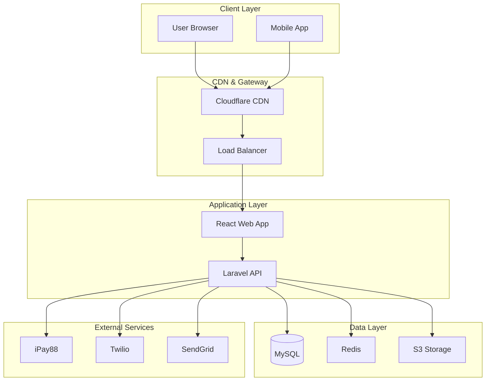
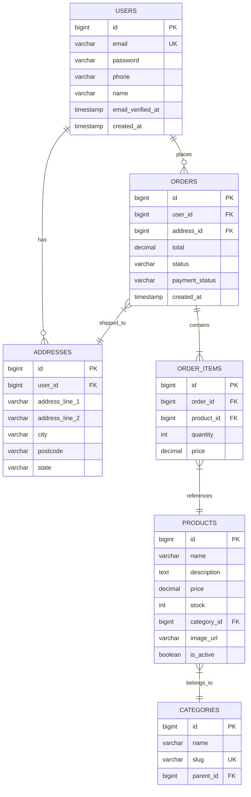
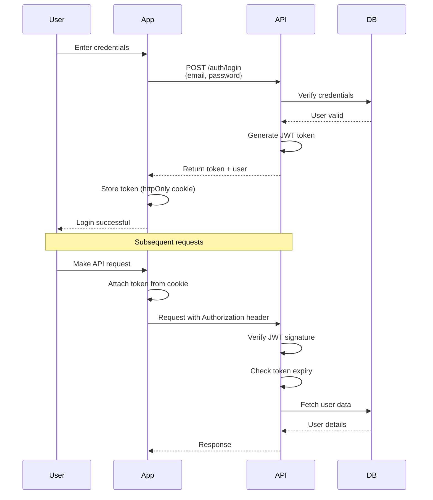
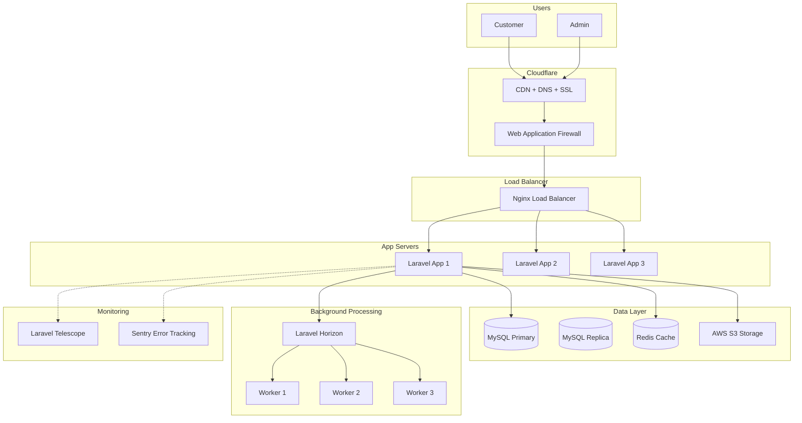

## Language Detection

- **CRITICAL**: Detect user's language and respond in the same language
- If user uses **Bahasa Melayu (Malay)**, respond entirely in **Bahasa Melayu Malaysia**
- If user uses **English**, respond entirely in **English**
- **NEVER mix both languages in the same response** - use ONE language consistently

# SDS Skill

Standards and templates for creating comprehensive System Design Specification (SDS) documents.

## When to Use

- BRS finalized and need technical specifications
- Developer team ready to start implementation
- Architecture decisions need documentation
- Database design required
- API contracts need definition
- Handover to development team

## SDS Structure (12 Sections)

### 1. System Overview
**Purpose:** High-level system description

**Content:**
- One-paragraph summary
- Key technologies
- Architecture pattern (Monolithic/Microservices/Serverless)
- Target users and scale

**Format:**
```markdown
## 1. System Overview

**English:**
E-commerce platform built with Laravel (backend) + React (frontend) + MySQL.
Supports 1000 concurrent users, integrated dengan iPay88 untuk pembayaran FPX.
Architecture: Monolithic with service layer pattern.

**[BM] Nota:**
Sistem menggunakan Laravel (framework PHP) untuk backend dan React untuk frontend.
Reka bentuk: Monolitik dengan lapisan perkhidmatan.
```

---

### 2. Architecture

#### 2.1 High-Level Architecture Diagram
**Purpose:** Visual overview of system components

**Use Mermaid:**
```markdown

```

#### 2.2 Component Breakdown
```markdown
| Component | Technology | Purpose | Scale |
|-----------|-----------|---------|-------|
| Frontend | React 18 | User interface | 1000 concurrent |
| Backend API | Laravel 10 | Business logic | 1000 concurrent |
| Database | MySQL 8.0 | Data storage | 1TB, 1M rows |
| Cache | Redis | Session & performance | 10GB |
| Queue | Laravel Horizon | Background jobs | 100 jobs/min |
| Storage | AWS S3 | File storage | 100GB |
| CDN | Cloudflare | Static assets | Global |
```

#### 2.3 Technology Stack Justification
```markdown
**Frontend: React 18**
- Large ecosystem and community
- Component-based architecture
- React Native path for mobile
- Excellent developer tools

**Backend: Laravel 10**
- Mature framework with ORM (Eloquent)
- Built-in queue system (Horizon)
- Excellent documentation
- Strong testing support (PHPUnit)

**Database: MySQL 8.0**
- JSON column support
- Widely supported hosting
- Team familiar dengan tooling
- Cost-effective untuk SME
```

---

### 3. Data Model

#### 3.1 Entity-Relationship Diagram
```markdown

```

#### 3.2 Table Definitions

**Table: users**
```markdown
| Field | Type | Constraints | Default | Index |
|-------|------|-------------|---------|-------|
| id | BIGINT | PK, AUTO_INCREMENT | - | Primary |
| email | VARCHAR(255) | UNIQUE, NOT NULL | - | Unique |
| password | VARCHAR(255) | NOT NULL | - | - |
| phone | VARCHAR(20) | NULL | - | - |
| name | VARCHAR(255) | NOT NULL | - | - |
| email_verified_at | TIMESTAMP | NULL | NULL | - |
| remember_token | VARCHAR(100) | NULL | - | - |
| created_at | TIMESTAMP | - | CURRENT_TIMESTAMP | - |
| updated_at | TIMESTAMP | - | CURRENT_TIMESTAMP | - |

**Indexes:**
- PRIMARY: id
- UNIQUE: email
- INDEX: phone (for lookups)
- INDEX: created_at (for sorting)
```

**Table: products**
```markdown
| Field | Type | Constraints | Default | Index |
|-------|------|-------------|---------|-------|
| id | BIGINT | PK, AUTO_INCREMENT | - | Primary |
| name | VARCHAR(255) | NOT NULL | - | Fulltext |
| description | TEXT | NULL | - | Fulltext |
| price | DECIMAL(10,2) | NOT NULL | 0.00 | INDEX |
| stock | INT | NOT NULL | 0 | INDEX |
| category_id | BIGINT | FK, NOT NULL | - | Foreign |
| image_url | VARCHAR(500) | NULL | - | - |
| is_active | BOOLEAN | NOT NULL | true | INDEX |
| created_at | TIMESTAMP | - | CURRENT_TIMESTAMP | - |
| updated_at | TIMESTAMP | - | CURRENT_TIMESTAMP | - |

**Indexes:**
- PRIMARY: id
- FOREIGN: category_id → categories(id)
- INDEX: price (for range queries)
- INDEX: is_active (for filtering)
- FULLTEXT: name, description (for search)
```

#### 3.3 Index Strategy
```markdown
**Primary Indexes:**
- All tables: id (auto-increment PK)

**Foreign Key Indexes:**
- orders.user_id
- orders.address_id
- order_items.order_id
- order_items.product_id
- products.category_id

**Query Optimization Indexes:**
- users.email (login lookups)
- users.phone (search)
- products.price (filtering/sorting)
- products.is_active (filtering)
- products.category_id (category filtering)
- orders.user_id (user order history)
- orders.created_at (recent orders)

**Full-Text Indexes:**
- products.name (search)
- products.description (search)

**Composite Indexes:**
- products(category_id, is_active, price) - category browsing
- orders(user_id, created_at) - user order history
```

#### 3.4 Migration Strategy
```php
// Example Laravel Migration
Schema::create('products', function (Blueprint $table) {
    $table->id();
    $table->string('name');
    $table->text('description')->nullable();
    $table->decimal('price', 10, 2);
    $table->integer('stock')->default(0);
    $table->foreignId('category_id')->constrained();
    $table->string('image_url', 500)->nullable();
    $table->boolean('is_active')->default(true);
    $table->timestamps();
    
    // Indexes
    $table->index('price');
    $table->index('is_active');
    $table->index(['category_id', 'is_active', 'price']);
    $table->fullText(['name', 'description']);
});
```

---

### 4. API Specifications

#### 4.1 Authentication Endpoints

**POST /api/v1/auth/register**
```yaml
Description: Register new user account
Request:
  Content-Type: application/json
  Body:
    name: string (required, min: 2, max: 255)
    email: string (required, email, unique)
    password: string (required, min: 8, confirmed)
    password_confirmation: string (required)
    phone: string (required, regex: /^[0-9]{10,11}$/)

Response 201 Created:
  Body:
    success: true
    data:
      user:
        id: integer
        name: string
        email: string
        phone: string
        created_at: datetime
    message: "Registration successful. Please verify your email."

Response 422 Validation Error:
  Body:
    success: false
    error:
      code: VALIDATION_ERROR
      message: "The given data was invalid"
      details:
        email: ["Email already exists"]
        password: ["Password must be at least 8 characters"]
```

**POST /api/v1/auth/login**
```yaml
Description: Authenticate user and get access token
Request:
  Content-Type: application/json
  Body:
    email: string (required, email)
    password: string (required)

Response 200 OK:
  Body:
    success: true
    data:
      token: string (JWT, expires in 1 hour)
      refresh_token: string (expires in 7 days)
      user:
        id: integer
        name: string
        email: string
        phone: string

Response 401 Unauthorized:
  Body:
    success: false
    error:
      code: INVALID_CREDENTIALS
      message: "Email or password is incorrect"
```

#### 4.2 Product Endpoints

**GET /api/v1/products**
```yaml
Description: List products with filtering and pagination
Query Parameters:
  category_id: integer (optional)
  search: string (optional, min: 3)
  min_price: decimal (optional, >= 0)
  max_price: decimal (optional, >= min_price)
  sort: enum(price_asc, price_desc, newest, popular) (default: newest)
  page: integer (optional, default: 1, min: 1)
  per_page: integer (optional, default: 20, max: 100)

Response 200 OK:
  Body:
    success: true
    data:
      - id: integer
        name: string
        description: string
        price: decimal
        image_url: string
        category:
          id: integer
          name: string
      meta:
        current_page: integer
        total_pages: integer
        total_items: integer
        per_page: integer
```

**GET /api/v1/products/{id}**
```yaml
Description: Get single product details
Path Parameters:
  id: integer (required)

Response 200 OK:
  Body:
    success: true
    data:
      id: integer
      name: string
      description: string
      price: decimal
      stock: integer
      image_url: string
      category:
        id: integer
        name: string
      related_products: [...]

Response 404 Not Found:
  Body:
    success: false
    error:
      code: PRODUCT_NOT_FOUND
      message: "Product not found"
```

#### 4.3 Order Endpoints

**POST /api/v1/orders**
```yaml
Description: Create new order
Authentication: Bearer Token (required)
Request:
  Content-Type: application/json
  Body:
    items: array (required, min: 1)
      - product_id: integer (required)
        quantity: integer (required, min: 1)
    shipping_address_id: integer (required)
    payment_method: enum(fpx, credit_card, grabpay) (required)
    notes: string (optional, max: 500)

Response 201 Created:
  Body:
    success: true
    data:
      order:
        id: integer
        order_number: string
        total: decimal
        status: string (pending)
        payment_url: string (redirect untuk payment)
      message: "Order created successfully. Please complete payment."

Response 400 Bad Request:
  Body:
    success: false
    error:
      code: INSUFFICIENT_STOCK
      message: "Some items are out of stock"
      details:
        items:
          - product_id: 123
            requested: 5
            available: 2
```

#### 4.4 Error Response Standard

**All errors follow this format:**
```json
{
  "success": false,
  "error": {
    "code": "ERROR_CODE",
    "message": "Human-readable error message",
    "details": {
      // Field-specific errors for validation
      // Or additional context untuk other errors
    }
  },
  "meta": {
    "timestamp": "2024-03-15T10:30:00Z",
    "request_id": "uuid-for-debugging"
  }
}
```

**Error Codes:**
- `VALIDATION_ERROR` - Input validation failed
- `UNAUTHORIZED` - Authentication required
- `FORBIDDEN` - Permission denied
- `NOT_FOUND` - Resource not found
- `INSUFFICIENT_STOCK` - Product out of stock
- `PAYMENT_FAILED` - Payment processing failed
- `INTERNAL_ERROR` - Server error (500)

---

### 5. Component Design

#### 5.1 Service Layer Structure
```
app/
├── Services/
│   ├── AuthService.php
│   ├── ProductService.php
│   ├── OrderService.php
│   ├── PaymentService.php
│   ├── InventoryService.php
│   └── NotificationService.php
```

#### 5.2 Service Example: OrderService
```php
<?php

namespace App\Services;

use App\Models\Order;
use App\Models\Product;
use Illuminate\Support\Facades\DB;

class OrderService
{
    protected $paymentService;
    protected $inventoryService;
    protected $notificationService;
    
    public function __construct(
        PaymentService $paymentService,
        InventoryService $inventoryService,
        NotificationService $notificationService
    ) {
        $this->paymentService = $paymentService;
        $this->inventoryService = $inventoryService;
        $this->notificationService = $notificationService;
    }
    
    public function createOrder(array $data): Order
    {
        return DB::transaction(function () use ($data) {
            // 1. Validate stock
            $this->inventoryService->validateStock($data['items']);
            
            // 2. Create order
            $order = Order::create([
                'user_id' => auth()->id(),
                'total' => $this->calculateTotal($data['items']),
                'status' => 'pending',
                // ...
            ]);
            
            // 3. Create order items
            foreach ($data['items'] as $item) {
                $order->items()->create($item);
            }
            
            // 4. Reserve inventory
            $this->inventoryService->reserveStock($order);
            
            // 5. Initialize payment
            $paymentUrl = $this->paymentService->initialize($order);
            $order->update(['payment_url' => $paymentUrl]);
            
            // 6. Send notification
            $this->notificationService->sendOrderConfirmation($order);
            
            return $order;
        });
    }
    
    public function processPaymentCallback(Order $order, array $paymentData): void
    {
        if ($paymentData['status'] === 'success') {
            $order->update(['status' => 'paid']);
            $this->inventoryService->confirmStock($order);
            $this->notificationService->sendPaymentConfirmation($order);
        } else {
            $order->update(['status' => 'payment_failed']);
            $this->inventoryService->releaseStock($order);
        }
    }
}
```

---

### 6. Security Architecture

#### 6.1 Authentication Flow
```markdown

```

#### 6.2 Authorization Matrix (RBAC)
```markdown
| Feature | Customer | Staff | Admin | Super Admin |
|---------|----------|-------|-------|-------------|
| View products | ✅ | ✅ | ✅ | ✅ |
| Place orders | ✅ | ❌ | ✅ | ✅ |
| View own orders | ✅ | ❌ | ✅ | ✅ |
| View all orders | ❌ | ✅ | ✅ | ✅ |
| Manage products | ❌ | ❌ | ✅ | ✅ |
| Manage users | ❌ | ❌ | ❌ | ✅ |
| View reports | ❌ | ❌ | ✅ | ✅ |
| System settings | ❌ | ❌ | ❌ | ✅ |
```

#### 6.3 Data Protection
```markdown
**Password Security:**
- Hashing: Bcrypt dengan cost factor 12
- Minimum length: 8 characters
- Complexity: Upper, lower, number, symbol
- Reset: Secure token (expires dalam 1 hour)

**Sensitive Data:**
- Encryption at rest: AES-256
- Encryption in transit: TLS 1.3
- Credit card: Tokenization (tidak store actual numbers)
- API keys: Environment variables, never dalam code

**Input Validation:**
- SQL injection: Parameterized queries (Eloquent ORM)
- XSS: Output escaping (Blade/React auto-escape)
- CSRF: Token validation untuk state-changing requests
- File upload: Type validation, size limits, virus scan
```

---

### 7. Scalability & Performance

#### 7.1 Traffic Projections
```markdown
| Month | Orders/Day | Concurrent Users | DB Size |
|-------|------------|------------------|---------|
| 1 | 50 | 50 | 10GB |
| 3 | 200 | 150 | 25GB |
| 6 | 500 | 300 | 50GB |
| 12 | 1000 | 500 | 100GB |
```

#### 7.2 Caching Strategy
```markdown
| Data | Cache Key | Duration | Store |
|------|-----------|----------|-------|
| Product list | products:list:{filters} | 5 min | Redis |
| Product detail | products:{id} | 15 min | Redis |
| User session | sessions:{token} | 1 hour | Redis |
| Categories | categories:all | 1 hour | Redis |
| Home page | pages:home | 10 min | Redis |

**Cache Invalidation:**
- Product updated → Clear product cache
- New order placed → Clear user orders cache
- Price changed → Clear filtered product caches
```

#### 7.3 Database Optimization
```markdown
**Query Optimization:**
- Eager loading untuk relationships
- Select specific columns (avoid SELECT *)
- Use indexes untuk WHERE clauses
- Pagination untuk large datasets

**Connection Pooling:**
- Max connections: 20 per app instance
- Connection timeout: 30 seconds
- Idle timeout: 10 minutes

**Read Replicas (Future):**
- Master: Write operations
- Replica 1: Read operations
- Replica 2: Reporting queries
```

---

### 8. Decision Log ⭐

## DEC-001: Why Laravel over Node.js
**Context:** Need robust framework dengan ORM and queue system untuk e-commerce
**Decision:** Use Laravel 10 untuk backend
**Rationale:**
1. **Eloquent ORM** - Excellent untuk complex queries dan relationships
2. **Built-in Queue System** - Laravel Horizon for background jobs
3. **Mature Ecosystem** - Thousands of packages, large community
4. **Team Expertise** - Developers familiar dengan PHP/Laravel
5. **Rapid Development** - Convention over configuration, scaffolding tools
6. **Testing Support** - PHPUnit integration, feature tests
7. **Documentation** - Comprehensive, well-maintained docs

**Trade-offs:**
- ✅ **Pros:** Faster development, better ORM, mature ecosystem
- ❌ **Cons:** Higher memory usage than Node, less async capabilities

**Alternatives Considered:**
- Node.js + Express: Good untuk real-time, but ORM options inferior
- Django: Good, but team lebih familiar dengan PHP

**Date:** 15/03/2024
**Status:** ✅ Active
**Reversible:** Yes (can migrate API layer later)

---

## DEC-002: Why React over Vue
**Context:** Frontend framework selection untuk web application
**Decision:** Use React 18
**Rationale:**
1. **Largest Community** - More resources, libraries, developers
2. **Job Market** - Easier to hire React developers
3. **Mobile Path** - React Native for future mobile app
4. **UI Libraries** - Chakra UI, Material-UI, Ant Design
5. **State Management** - Redux Toolkit, Zustand options
6. **Developer Tools** - Excellent debugging tools

**Trade-offs:**
- ✅ **Pros:** Larger ecosystem, mobile path, more hiring options
- ❌ **Cons:** Steeper learning curve, more boilerplate

**Alternatives Considered:**
- Vue 3: Simpler, good documentation, but smaller ecosystem
- Angular: Too heavy untuk this project scope

**Date:** 15/03/2024
**Status:** ✅ Active

---

## DEC-003: Why MySQL over PostgreSQL
**Context:** Primary database selection untuk relational data
**Decision:** Use MySQL 8.0
**Rationale:**
1. **Hosting Support** - Most Malaysian providers support MySQL better
2. **Team Familiarity** - Developers lebih comfortable dengan MySQL
3. **JSON Support** - MySQL 8.0 has good JSON column support
4. **Cost** - Generally cheaper hosting options
5. **Tooling** - PHPMyAdmin, MySQL Workbench widely used

**Trade-offs:**
- ✅ **Pros:** Better hosting support, team familiar, cheaper
- ❌ **Cons:** Less advanced JSON operations than PostgreSQL

**When to Reconsider:**
- Complex JSON queries needed
- Advanced geospatial features required
- Heavy analytics workload

**Date:** 16/03/2024
**Status:** ✅ Active

---

## DEC-004: Why iPay88 over Stripe
**Context:** Payment gateway untuk Malaysian market
**Decision:** Use iPay88 Malaysia
**Rationale:**
1. **Local Payment Methods** - Supports FPX (bank transfer), major Malaysian banks
2. **Local Support** - Malaysian company, local support team
3. **Currency** - Native MYR support, no conversion fees
4. **Compliance** - Approved by Bank Negara Malaysia
5. **Customer Trust** - Malaysians familiar dengan iPay88

**Trade-offs:**
- ✅ **Pros:** FPX support, local support, BNM approved
- ❌ **Cons:** Higher fees than Stripe, less developer-friendly API

**Alternatives Considered:**
- Stripe: Better API, but no FPX support (critical for Malaysian market)
- PayPal: Less popular in Malaysia, higher fees

**Date:** 17/03/2024
**Status:** ✅ Active

---

## DEC-005: Monolithic vs Microservices
**Context:** Architecture pattern selection
**Decision:** Use Monolithic architecture with service layer
**Rationale:**
1. **Team Size** - Small team (3 developers), microservices overkill
2. **Complexity** - Monolithic simpler untuk MVP
3. **Deployment** - Single deploy easier than orchestrating multiple services
4. **Debugging** - Easier to trace issues dalam single codebase
5. **Future Path** - Can extract services later if needed

**Trade-offs:**
- ✅ **Pros:** Simpler, faster development, easier deployment
- ❌ **Cons:** Risk of tight coupling, harder to scale individual components

**Future Consideration:**
- Phase 2: May extract payment service
- Phase 3: May extract notification service

**Date:** 18/03/2024
**Status:** ✅ Active

---

### 9. Implementation Phases

#### Phase 1: Foundation (Week 1-2)
**Goal:** Development environment ready, core infrastructure

**Tasks:**
- [ ] Setup Laravel project dengan Vite
- [ ] Setup React frontend
- [ ] Configure database dan migrations
- [ ] Setup authentication (Sanctum)
- [ ] Setup CI/CD pipeline
- [ ] Create base components

**Deliverables:**
- Development environment
- Database schema
- Auth system working
- Deployment pipeline

#### Phase 2: Core Commerce (Week 3-6)
**Goal:** E-commerce functionality complete

**Tasks:**
- [ ] Product catalog (CRUD)
- [ ] Product search dan filtering
- [ ] Shopping cart functionality
- [ ] Checkout flow
- [ ] Payment gateway integration (iPay88)
- [ ] Order management

**Deliverables:**
- Working product catalog
- Complete checkout flow
- Payment processing
- Order tracking

#### Phase 3: Operations (Week 7-10)
**Goal:** Admin and operational features

**Tasks:**
- [ ] Admin dashboard
- [ ] Inventory management
- [ ] Order management (admin)
- [ ] User management
- [ ] Reporting (basic)
- [ ] Email/SMS notifications

**Deliverables:**
- Admin dashboard
- Inventory system
- Notification system
- Basic reports

#### Phase 4: Polish & Deploy (Week 11-12)
**Goal:** Production ready

**Tasks:**
- [ ] Performance optimization
- [ ] Security audit
- [ ] User acceptance testing
- [ ] Bug fixes
- [ ] Documentation
- [ ] Production deployment

**Deliverables:**
- Production deployment
- User documentation
- API documentation
- Handover complete

---

### 10. Testing Strategy

#### 10.1 Unit Test Coverage Targets
```markdown
| Component | Target Coverage | Priority |
|-----------|----------------|----------|
| Models | 90% | High |
| Services | 85% | High |
| Controllers | 80% | Medium |
| Middleware | 75% | Medium |
| Overall | 85% | High |
```

#### 10.2 Unit Test Example
```php
<?php

namespace Tests\Unit\Services;

use App\Services\OrderService;
use App\Models\Order;
use App\Models\Product;
use Tests\TestCase;

class OrderServiceTest extends TestCase
{
    protected $orderService;
    
    protected function setUp(): void
    {
        parent::setUp();
        $this->orderService = app(OrderService::class);
    }
    
    public function test_can_create_order_with_valid_data()
    {
        // Arrange
        $product = Product::factory()->create(['price' => 100, 'stock' => 10]);
        $data = [
            'items' => [
                ['product_id' => $product->id, 'quantity' => 2]
            ],
            'shipping_address_id' => 1,
            'payment_method' => 'fpx'
        ];
        
        // Act
        $order = $this->orderService->createOrder($data);
        
        // Assert
        $this->assertInstanceOf(Order::class, $order);
        $this->assertEquals(200, $order->total);
        $this->assertEquals('pending', $order->status);
        $this->assertDatabaseHas('order_items', [
            'order_id' => $order->id,
            'product_id' => $product->id,
            'quantity' => 2
        ]);
    }
    
    public function test_cannot_create_order_with_insufficient_stock()
    {
        // Arrange
        $product = Product::factory()->create(['stock' => 1]);
        $data = [
            'items' => [
                ['product_id' => $product->id, 'quantity' => 5]
            ]
        ];
        
        // Act & Assert
        $this->expectException(InsufficientStockException::class);
        $this->orderService->createOrder($data);
    }
}
```

#### 10.3 Integration Tests
```markdown
**Test Scenarios:**
1. **Authentication Flow**
   - Register → Verify email → Login → Access protected route
   
2. **Payment Flow**
   - Create order → Initialize payment → Callback success → Inventory updated
   
3. **Order Lifecycle**
   - Place order → Payment → Processing → Shipped → Delivered
   
4. **Inventory Management**
   - Create product → Place order → Stock reduced → Cancel order → Stock restored
```

#### 10.4 E2E Tests (Cypress)
```javascript
// cypress/e2e/checkout.cy.js
describe('Checkout Flow', () => {
  it('completes full checkout successfully', () => {
    // Login
    cy.visit('/login');
    cy.get('[data-testid=email]').type('test@example.com');
    cy.get('[data-testid=password]').type('password');
    cy.get('[data-testid=login-btn]').click();
    
    // Browse products
    cy.visit('/products');
    cy.get('[data-testid=product-card]').first().click();
    
    // Add to cart
    cy.get('[data-testid=add-to-cart]').click();
    cy.get('[data-testid=cart-count]').should('contain', '1');
    
    // Checkout
    cy.visit('/cart');
    cy.get('[data-testid=checkout-btn]').click();
    
    // Fill shipping
    cy.get('[data-testid=address-select]').select('1');
    cy.get('[data-testid=continue-payment]').click();
    
    // Select payment
    cy.get('[data-testid=payment-fpx]').click();
    cy.get('[data-testid=place-order]').click();
    
    // Verify order created
    cy.url().should('include', '/order-success');
    cy.get('[data-testid=order-number]').should('exist');
  });
});
```

---

### 11. Deployment Architecture

#### 11.1 Infrastructure Diagram
```markdown

```

#### 11.2 CI/CD Pipeline (GitHub Actions)
```yaml
# .github/workflows/deploy.yml
name: Deploy to Production

on:
  push:
    branches: [main]

jobs:
  test:
    runs-on: ubuntu-latest
    
    steps:
      - uses: actions/checkout@v3
      
      - name: Setup PHP
        uses: shivammathur/setup-php@v2
        with:
          php-version: '8.2'
          extensions: mbstring, mysql, redis
          
      - name: Setup Node
        uses: actions/setup-node@v3
        with:
          node-version: '18'
          
      - name: Install Dependencies
        run: |
          composer install --no-interaction --prefer-dist
          npm ci
          
      - name: Run Tests
        run: |
          php artisan test --coverage --min=85
          npm run test
          
      - name: Code Quality
        run: |
          composer audit
          npm audit
          
  deploy-staging:
    needs: test
    runs-on: ubuntu-latest
    
    steps:
      - name: Deploy to Staging
        run: |
          # Deployment commands
          echo "Deployed to staging"
          
  e2e-tests:
    needs: deploy-staging
    runs-on: ubuntu-latest
    
    steps:
      - name: Run E2E Tests
        run: |
          npm run cypress:run
          
  deploy-production:
    needs: e2e-tests
    runs-on: ubuntu-latest
    environment: production
    
    steps:
      - name: Deploy to Production
        run: |
          # Production deployment
          echo "Deployed to production"
```

#### 11.3 Environment Configuration
```
Production Environment:
- Server: DigitalOcean Droplet (4GB RAM, 2 vCPUs) × 3
- Database: Managed MySQL (2GB RAM)
- Cache: Managed Redis (1GB RAM)
- Storage: AWS S3 (100GB)
- CDN: Cloudflare Pro
- Queue: Laravel Horizon (3 workers)
- Monitoring: Laravel Telescope + Sentry
```

---

### 12. Future Considerations

#### Phase 2: Mobile Application (Month 4-6)
**Preparation in Current Architecture:**
- API versioning (/api/v1/)
- JWT authentication (mobile-friendly)
- Responsive design (mobile-first CSS)
- Push notification infrastructure (FCM tokens)

**Tech Stack:**
- React Native (reuse business logic)
- Same backend API
- Same database
- Additional: Firebase Cloud Messaging

#### Phase 3: Multi-Vendor Marketplace (Month 7-12)
**Database Preparation:**
- `products` table already has nullable `vendor_id`
- Can add `vendors` table later
- Admin roles can be extended

**Architecture Changes:**
- Extract vendor service
- Add vendor dashboard
- Commission calculation system

#### Phase 4: Advanced Analytics
**Future Additions:**
- Google Analytics integration
- Custom analytics dashboard
- Customer behavior tracking
- Sales forecasting

---

## Quality Standards

Before completing SDS, verify:
- ✅ All 12 sections present
- ✅ Architecture diagram (Mermaid)
- ✅ Database ERD with 5+ entities
- ✅ API specs for 10+ endpoints
- ✅ Decision log has ≥3 entries
- ✅ Traceability to BRS requirements (REQ-xxx)
- ✅ Security section comprehensive
- ✅ Scalability plan included
- ✅ Deployment architecture documented

## Common Patterns

### Service Layer Pattern
```php
// Controller (thin)
class OrderController extends Controller
{
    public function store(CreateOrderRequest $request)
    {
        $order = $this->orderService->createOrder($request->validated());
        return response()->json(['order' => $order], 201);
    }
}

// Service (business logic)
class OrderService
{
    public function createOrder(array $data): Order
    {
        // Business logic here
    }
}

// Model (data)
class Order extends Model
{
    // Relationships, accessors, mutators
}
```

### Repository Pattern (Optional)
```php
interface ProductRepositoryInterface
{
    public function find($id);
    public function search($filters);
    public function create(array $data);
}

class ProductRepository implements ProductRepositoryInterface
{
    public function find($id)
    {
        return Product::findOrFail($id);
    }
    
    public function search($filters)
    {
        return Product::filter($filters)->paginate();
    }
}
```

## Success Metrics

Good SDS should enable:
- 🎯 **Developer onboarding** dalam 2 days
- 🎯 **Implementation** without clarification questions
- 🎯 **Scalability** to 10x traffic
- 🎯 **Security audit** pass tanpa major issues
- 🎯 **Future phases** clear path
