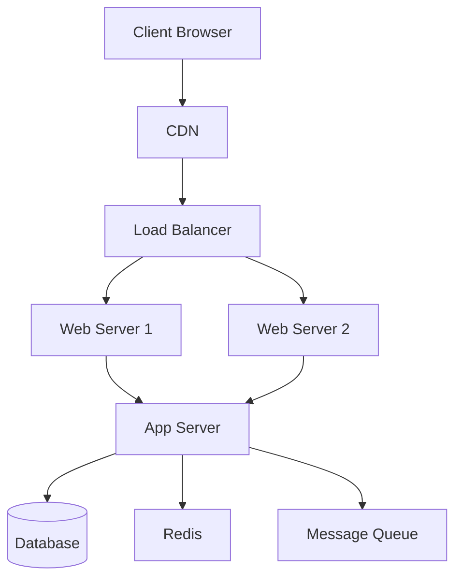
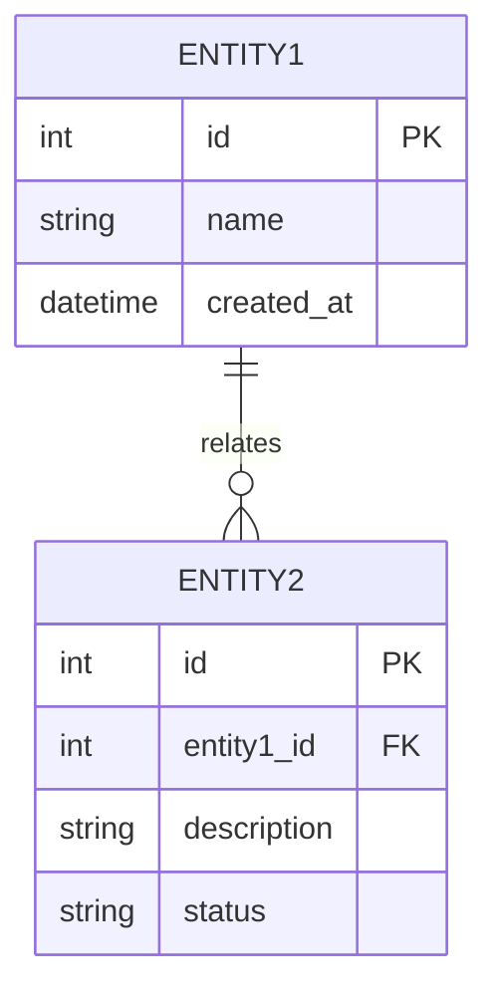
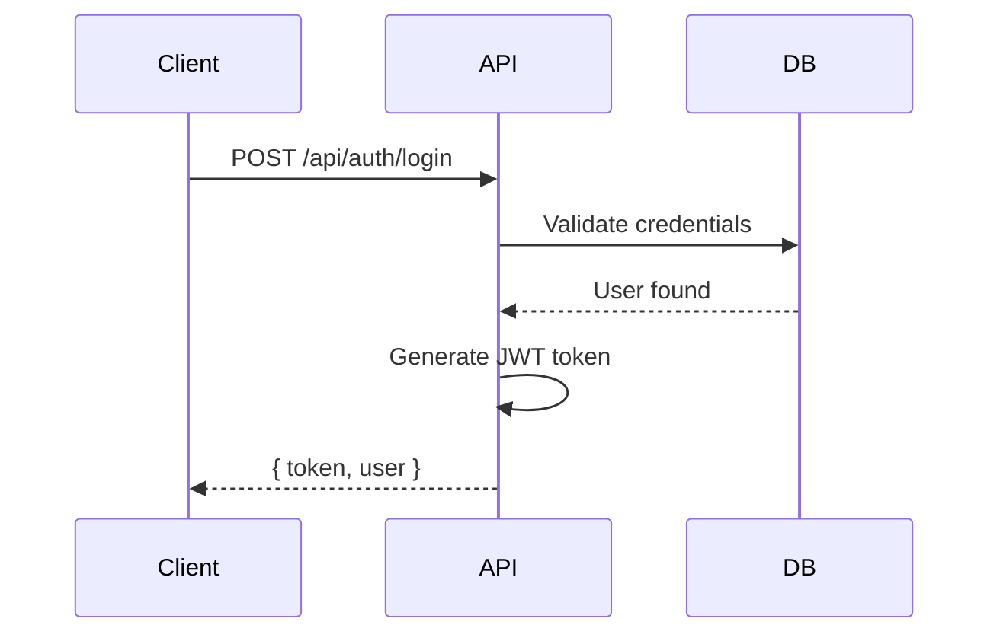

# SDS Skill

Handles the technical blueprinting of the system.

## Key Components

### 1. Architecture Design

- Define stack components (e.g., HATA Stack: HTMX, Alpine, Tailwind, Alpine).
- Document infrastructure (Cloud, VPS, or WSL).
- Create deployment architecture diagram (Mermaid).

#### Deployment Diagram Template

```mermaid
graph TB
    Client[Client Browser] --> CDN[CDN]
    CDN --> LB[Load Balancer]
    LB --> Web1[Web Server 1]
    LB --> Web2[Web Server 2]
    Web1 --> App[App Server]
    Web2 --> App
    App --> DB[(Database)]
    App --> Cache[Redis]
    App --> Queue[Message Queue]
```

### 2. Database Modeling

- Generate Mermaid ERD diagrams.
- Define indexing and normalization strategies.
- **Auto-Sync**: If `@database-expert` changes a table, SDS MUST be updated.

#### ERD Template (Mermaid)

```mermaid
erDiagram
    ENTITY1 ||--o{ ENTITY2 : relates
    ENTITY1 {
        int id PK
        string name
        datetime created_at
    }
    ENTITY2 {
        int id PK
        int entity1_id FK
        string description
        string status
    }
```

### 3. API & Service Contracts

Define endpoint structures with full request/response schemas:

```yaml
ENDPOINT: [METHOD] /api/v1/[resource]
Auth: [Bearer/JWT/Sanctum/None]
Request:
  headers:
    Content-Type: application/json
    Authorization: Bearer {token}
  body:
    field1: string (required) - [description]
    field2: integer (optional) - [description]
Response 200:
  body:
    id: integer
    field1: string
    created_at: datetime
Response 4xx:
  body:
    error: string
    details: object
```

### 4. Data Flow Diagrams

Document critical paths:


```mermaid
sequenceDiagram
    Client->>API: POST /api/auth/login
    API->>DB: Validate credentials
    DB-->>API: User found
    API->>API: Generate JWT token
    API-->>Client: { token, user }
```

## Logic Rules

- **N+1 Prevention**: Every database design must be audited for N+1 query risks.
- **Impact Tracking**: Every technical choice in SDS must be logged as a `DEC` in `DECISIONS.md`.
- **Component Linking**: Every API endpoint must reference a `REQ-ID` from the BRS.

## SDS Review Checklist

- [ ] Architecture diagram present
- [ ] ERD diagram with all entities
- [ ] API contracts for all endpoints
- [ ] Decision log entries (>= 3)
- [ ] Traceability to BRS requirements
- [ ] Security section (CORS, rate limiting, encryption)
- [ ] Scalability considerations
- [ ] Deployment architecture

## Changelog & Versioning

Every SDS document must include a changelog section:

```markdown
## Changelog

| Version | Date | Changes | CR Reference |
|---------|------|---------|--------------|
| 1.0 | [Date] | Initial SDS from SRS v1.0 | — |
| 1.1 | [Date] | Added payment API contract, payment table | CR-001 |
| 1.2 | [Date] | Modified login endpoint: added MFA field | CR-002 |
```

### Change Request Handling

When SRS changes, SDS must be updated:

```
1. Read updated SRS (detect new version or CR-XXX)
2. Identify affected components:
   - Database: new tables/columns?
   - API: new/modified endpoints?
   - Architecture: new services?
3. Update ERD, API contracts, deployment diagram
4. Bump SDS version
5. Log change in changelog
6. Call @planner to update task estimates
7. Notify @backend-coder and @frontend-coder of API changes
```

## Guidelines

- **Scalability**: Design for modular growth (Service Pattern).
- **Security**: Include CORS, Rate Limiting, and Data Encryption specs in the design.
- **Integration**: SDS feeds into `@planner` for task estimation and `@backend-coder`/`@frontend-coder` for implementation.
